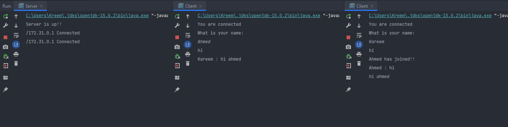

# ClientServer
Chat room through TCP network using Java. Runs as either a server or a client, multiple clients can join a single server and start chatting.  
This program was made an assignment for the Networking course taught by Cairo University - Faculty of Computers and Artificial Intelligence.

## How to run the app:
1. Run the [server main function](src/Server.java).
2. Run as many clients as you want with the [client main function](src/Client.java).

